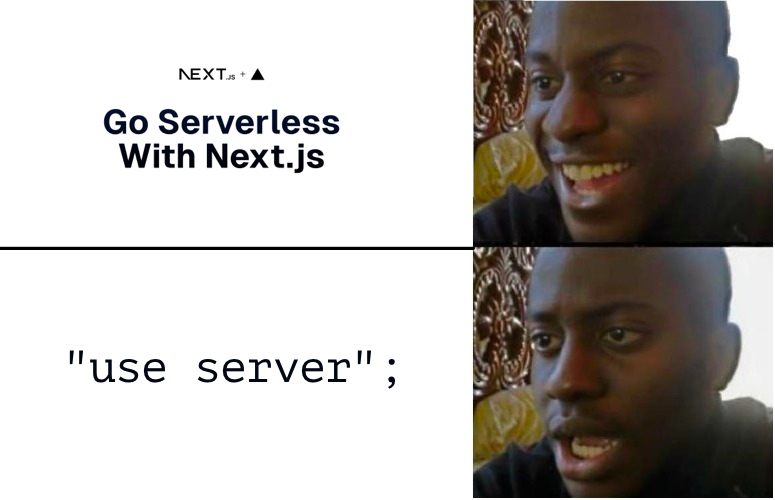

# 02 — Next.js App Router

## What is Next.js?

Next.js is a React framework that adds structure, routing, and server-side capabilities to React. If you've used React before, you know it's a UI library — it renders components but doesn't tell you how to handle routing, data fetching, or server logic. Next.js fills all of that in.

The **App Router** is the current (and recommended) way to build Next.js apps. It was introduced in Next.js 13 and replaces the older Pages Router. Most tutorials and Stack Overflow answers you'll find are about the Pages Router — if something looks unfamiliar or uses `getServerSideProps`, it's probably Pages Router content.

---

## The `app/` Directory

Everything in a Next.js App Router project lives under the `app/` folder. The folder structure **is** the route structure.

```
app/
├── layout.tsx         → Root layout (wraps every page)
├── page.tsx           → The / route
├── globals.css
├── tasks/
│   ├── page.tsx       → The /tasks route
│   └── [id]/
│       └── page.tsx   → The /tasks/123 route (dynamic segment)
└── api/
    └── tasks/
        └── route.ts   → API endpoint at /api/tasks
```

### Special File Names

Next.js gives special meaning to certain filenames within a folder:

| File | Purpose |
|------|---------|
| `page.tsx` | The UI for that route — makes the route publicly accessible |
| `layout.tsx` | Wraps pages in this folder and all nested folders |
| `loading.tsx` | Shown while the page is loading (automatic Suspense) |
| `error.tsx` | Shown when an error is thrown in the page |
| `route.ts` | API endpoint (no UI) |

---

## Server Components vs Client Components

This is the most important concept to understand in the App Router.

**By default, every component is a Server Component.** Server Components run only on the server — they never ship JavaScript to the browser. This means they can:
- Directly access databases, filesystems, and environment variables
- Not use React hooks like `useState` or `useEffect`
- Not attach browser event listeners

**Client Components** opt in with `"use client"` at the top of the file. They run in the browser and can use hooks and event handlers.

```tsx
// ServerComponent.tsx — runs on the server, no "use client"
// Can fetch directly from DB, can't use useState

async function TaskList() {
  const tasks = await db.task.findMany(); // direct DB access!
  return (
    <ul>
      {tasks.map(task => <li key={task.id}>{task.title}</li>)}
    </ul>
  );
}
```

```tsx
// ClientComponent.tsx — runs in browser
"use client";

import { useState } from "react";

function AddTaskButton() {
  const [clicked, setClicked] = useState(false);
  return (
    <button onClick={() => setClicked(true)}>
      {clicked ? "Adding..." : "Add Task"}
    </button>
  );
}
```

### The Mental Model

Think of it as a tree. Server Components sit at the top and do the heavy data work. Client Components sit at the leaves and handle interactivity.

```
RootLayout (server)
  └── TasksPage (server) ← fetches tasks from DB
        ├── TaskTable (server) ← renders rows
        └── AddTaskButton (client) ← has onClick handler
```

> **Rule of thumb:** Keep things server components until you need interactivity or browser APIs. Push `"use client"` as far down the tree as possible.

---

## Layouts

A `layout.tsx` wraps all pages in its folder. The root layout at `app/layout.tsx` is required and wraps your entire app.

```tsx
// app/layout.tsx
export default function RootLayout({
  children,
}: {
  children: React.ReactNode;
}) {
  return (
    <html lang="en">
      <body>
        <nav>My App</nav>
        {children}  {/* ← Each page renders here */}
      </body>
    </html>
  );
}
```

Nested layouts work the same way — a `app/tasks/layout.tsx` wraps only pages inside `tasks/`.

---

## Data Fetching

In Server Components, you fetch data however you want — no special APIs required. Just `async/await` directly in the component.

```tsx
// app/tasks/page.tsx
async function TasksPage() {
  // This runs on the server — the DB URL never reaches the browser
  const res = await fetch("https://api.example.com/tasks");
  const tasks = await res.json();

  return <TaskTable tasks={tasks} />;
}
```

For database access, you'll typically call Prisma directly (covered in module 04):

```tsx
import { prisma } from "@/lib/prisma";

async function TasksPage() {
  const tasks = await prisma.task.findMany({
    orderBy: { createdAt: "desc" },
  });
  return <TaskTable tasks={tasks} />;
}
```

---

## API Routes

`route.ts` files create API endpoints. They export functions named after HTTP methods.

```ts
// app/api/tasks/route.ts

import { prisma } from "@/lib/prisma";
import { NextResponse } from "next/server";

export async function GET() {
  const tasks = await prisma.task.findMany();
  return NextResponse.json(tasks);
}

export async function POST(request: Request) {
  const body = await request.json();
  const task = await prisma.task.create({
    data: { title: body.title, status: "todo" },
  });
  return NextResponse.json(task, { status: 201 });
}
```

## Helpful (optional, but encouraged) videos
[Fireship: Next.js in 100 seconds/Full tutorial](https://www.youtube.com/watch?v=Sklc_fQBmcs)
[Fireship: Typescript](https://www.youtube.com/watch?v=zQnBQ4tB3ZA)

---

## Next Steps

Head to [EXERCISES.md](./EXERCISES.md) to build pages and routes, then [MINI_PROJECT.md](./MINI_PROJECT.md) to scaffold the Task Tracker UI.

## Tasteful memes

